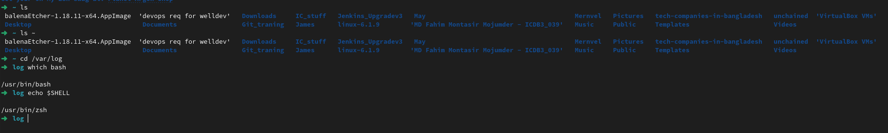
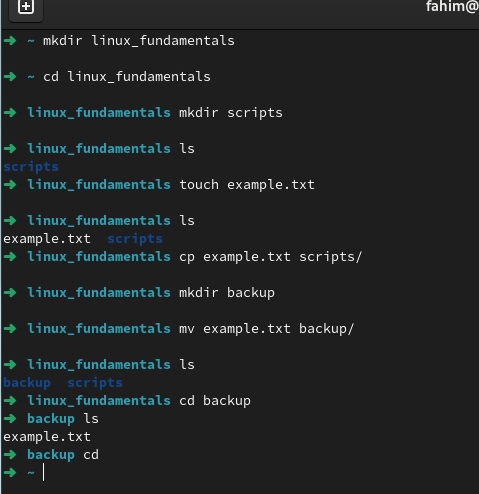
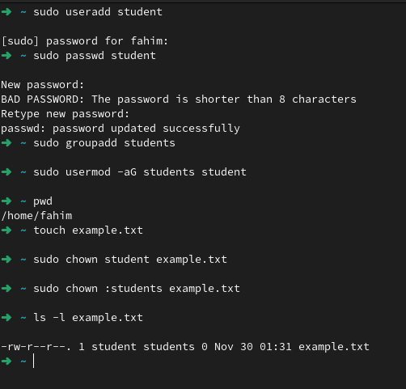
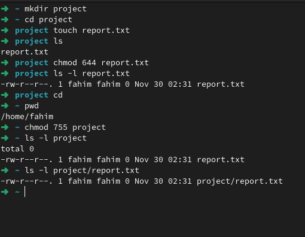
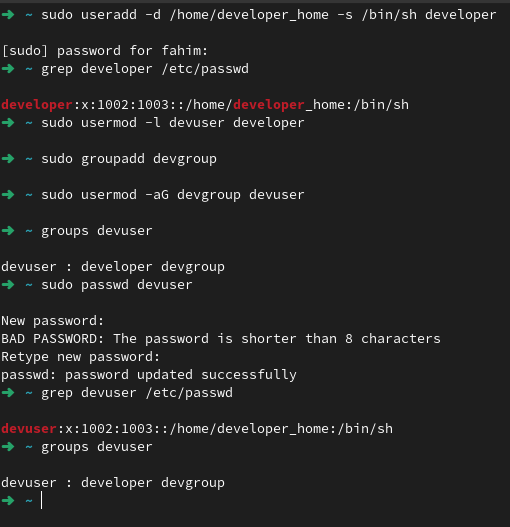
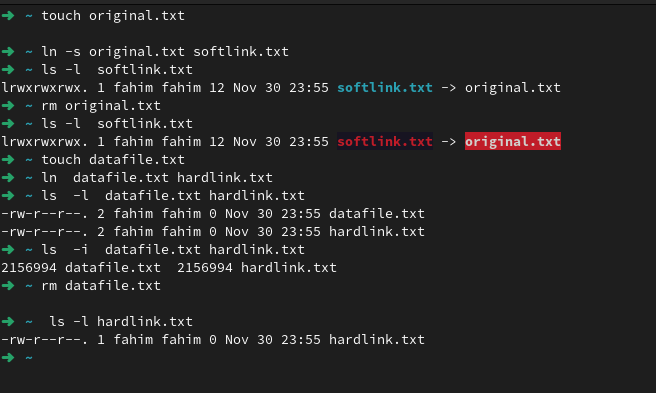
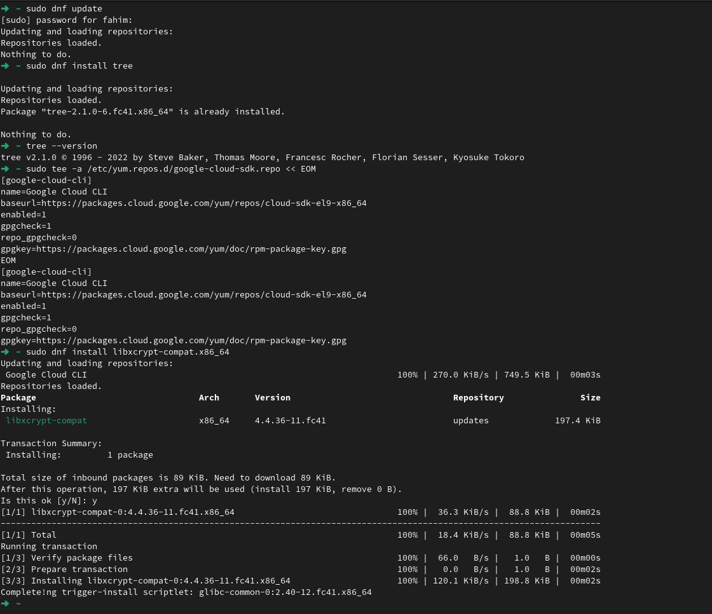
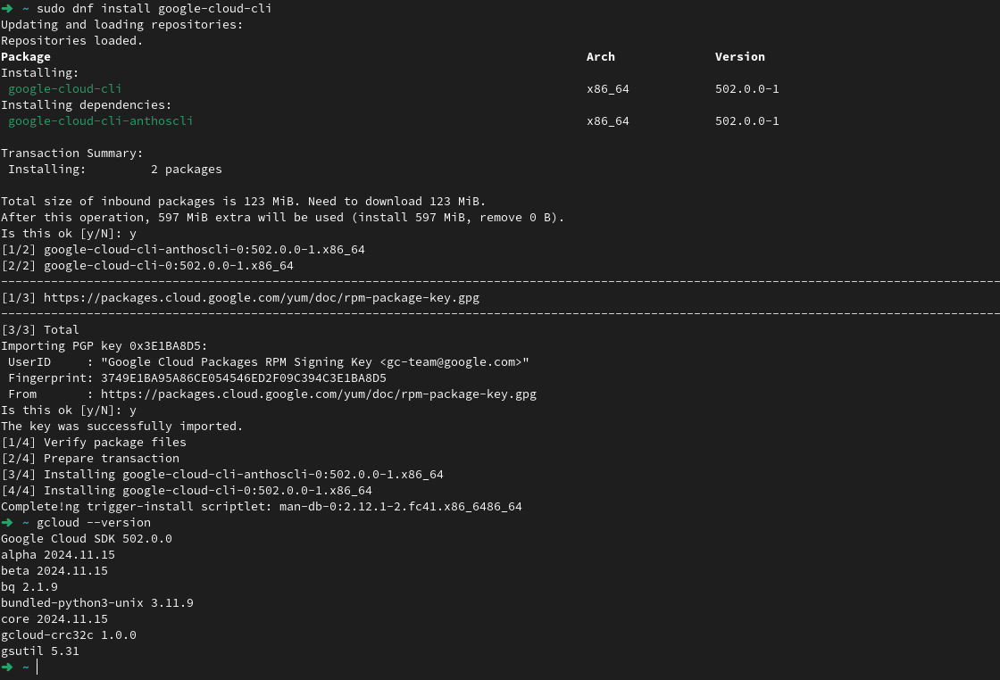

# Linux Fundamentals Documentation

This document details the steps performed for IC devops Linux Fundamentals - Assignment 1

---

## 1. File System Navigation

### Screenshot:


### Commands:
```bash
ls ~
```

```bash
cd /var/log
ls
```

```bash
which bash
```

```bash
echo $SHELL
```

---

## 2. File and Directory Operations

### Screenshot:


### Commands:
```bash
mkdir linux_fundamentals
```

```bash
mkdir linux_fundamentals/scripts
```

```bash
touch linux_fundamentals/example.txt
```

```bash
cp linux_fundamentals/example.txt linux_fundamentals/scripts/
```

```bash
mkdir linux_fundamentals/backup
```

```bash
mv linux_fundamentals/example.txt linux_fundamentals/backup/
```

```bash
ls linux_fundamentals/backup
```

---

## 3. File Modification

### Screenshot:


### Commands:
```bash
touch example.txt
```

```bash
sudo chown student example.txt
```

```bash
sudo chown :students example.txt
```

```bash
ls -l example.txt
```

---

## 4. Ownership

### Screenshot:


### Commands:
```bash
mkdir project
```

```bash
touch project/report.txt
```

```bash
chmod 644 project/report.txt
```

```bash
chmod 755 project
```

```bash
ls -l project/report.txt
```

```bash
ls -ld project
```

---

## 5. User add/modify

### Screenshot:


### Commands:
```bash
sudo useradd -d /home/developer_home -s /bin/sh developer
```

```bash
grep developer /etc/passwd
```

```bash
sudo usermod -l devuser developer
```

```bash
sudo groupadd devgroup
sudo usermod -aG devgroup devuser
```

```bash
sudo passwd devuser
```

```bash
grep devuser /etc/passwd
groups devuser
```

---

## 6. Hard/Soft Link

### Screenshot:


### Commands:
```bash
touch original.txt
```

```bash
ln -s original.txt softlink.txt
```

```bash
ls -l  softlink.txt 
```

```bash
rm original.txt 
```

```bash
ls -l  softlink.txt 
```

```bash
touch datafile.txt
```
```bash
ln  datafile.txt hardlink.txt
```
```bash
ls  -l  datafile.txt hardlink.txt 
```
```bash
ls  -i  datafile.txt hardlink.txt
```
```bash
rm datafile.txt
```
```bash
ls -l hardlink.txt 
```


---
## 7. Package installation

### Screenshot:



### Commands:
```bash
sudo dnf update
```

```bash
sudo dnf install tree
```

```bash
tree --version
```

```bash
sudo tee -a /etc/yum.repos.d/google-cloud-sdk.repo << EOM
[google-cloud-cli]
name=Google Cloud CLI
baseurl=https://packages.cloud.google.com/yum/repos/cloud-sdk-el9-x86_64
enabled=1
gpgcheck=1
repo_gpgcheck=0
gpgkey=https://packages.cloud.google.com/yum/doc/rpm-package-key.gpg
EOM 
```

```bash
sudo dnf install libxcrypt-compat.x86_64
```

```bash
sudo dnf install google-cloud-cli
```
```bash
gcloud --version
```


---